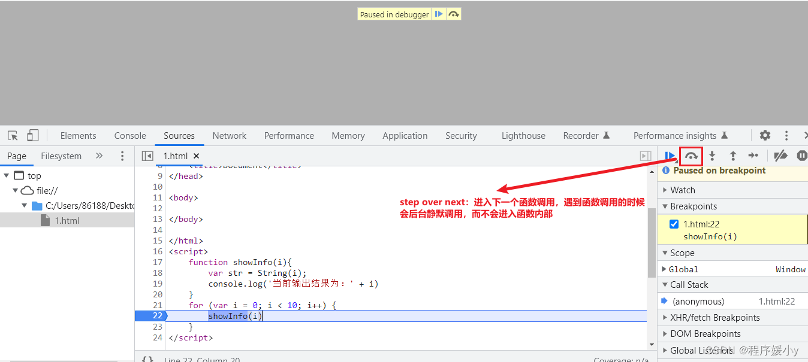
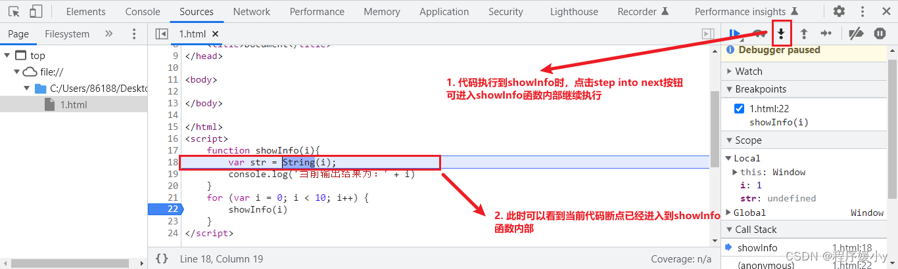
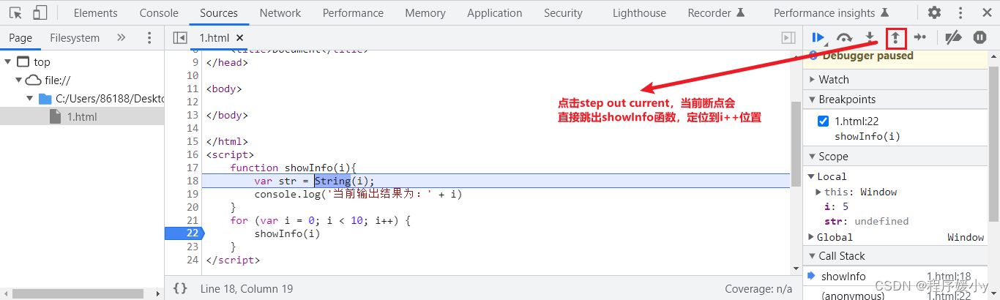
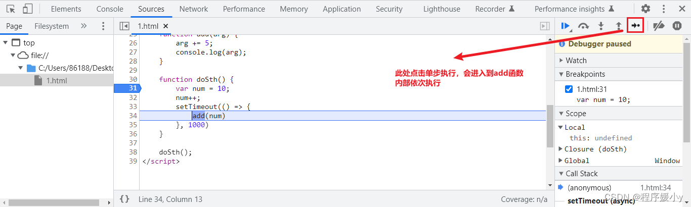
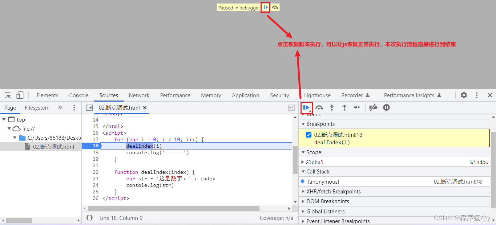

# Chrome浏览器断点调试选项

## 1. 单步跳过—F10

点击右侧菜单中的"单步跳过" `step over next`按钮来让代码进入下一个函数调用。

关于`step over next`:

- 它在意的是执行调用结果，并不会进入函数内部

- 当遇到自定义函数的时候，会在后台静默调用，直接得出结果。

	

如上图，当你点击`step over next`的时候，会直接跳过`showInfo`进而得出结果，而不是进入`showInfo`函数的内部继续单步执行

## 2. 单步进入—F11

如果在执行的时候遇到自定义函数，并且你希望让断点单步执行进入自定义 函数内部继续依次执行的话，可以点击"单步进入"step into next按钮

往往单步进入F11与单步跳过F10配合能让我们非常高效的调试代码，毕竟不是每一个函数你都需要进入内部去查看结果，所以该跳过就跳过，该进入就进入
## 3. 跳出—Shift+F11

如果你在调试的时候不小心进入了一个本来不关心的函数，此时可以点击"跳出"`step outcurrent`来跳出当前进入的函数。

## 4. 单步执行—F9

"单步执行"`step`不会区分任何自定义函数，所有脚本代码都会依次执行。

一般情况下，我们使用"单步执行"`step`很少,因为不是每一个自定义函数我们都需要进入到内部来观察其执行状态，所以实际开发调试中，我们使用"单步跳过"`step over next`+"单步进入"`step into next`更多

## 5. 恢复脚本执行—F8

如果我们想要放弃当前脚本的调试，可以点击"恢复脚本执行"`resume script excution`，这会让当前脚本直接执行到最后，如果要重新调试的话，保持断点存在的前提下刷新页面即可

比如：我们正在执行一个循环，并且希望查看这个循环的第八次，那么我们就可以连续点击这个按钮，直接跳过前七次循环，到达第八次循环，然后进行循环开始一步一步执行。